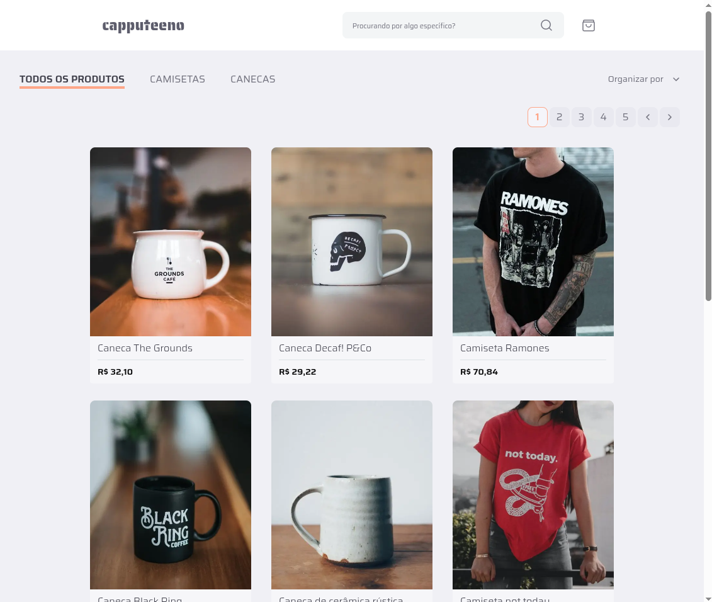
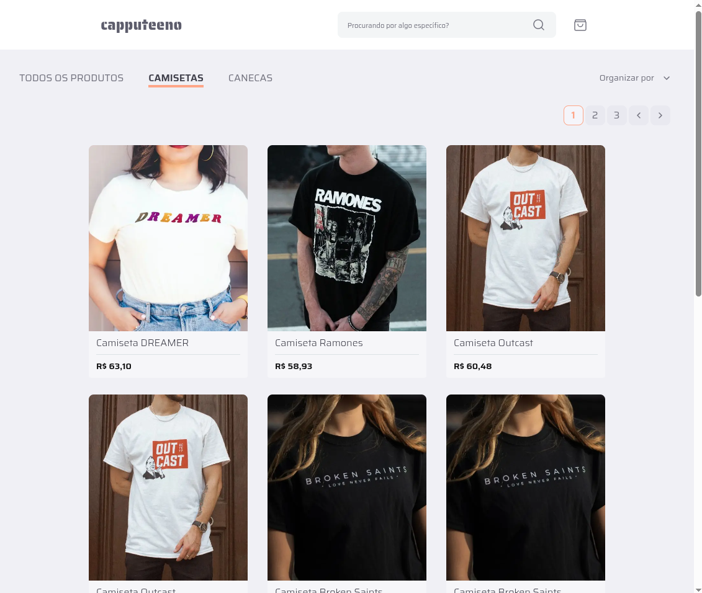
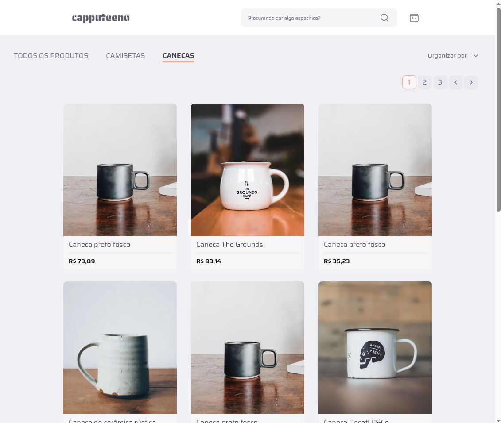

# Capputeeno 🍵👕



## Tabela de conteúdos
* [Sobre](#-sobre)
* [Tecnologias utilizadas](#-tecnologias-utilizadas)
* [Instalação](#️-instalação)
* [Demonstração de uso](#demonstração-de-uso)
* [Licença](#licença)

## 📌 Sobre

`Capputeeno` é a resolução do desafio [Frontend challenge](https://github.com/Rocketseat/frontend-challenge) da Rockeseat, o qual consiste na implementação de um protótipo de e-commerce para venda de canecas e camisetas que tem as seguintes funcionalidades:

- [ ] Catálogo de produtos com paginação `Pendente`
- [ ] Filtragem produtos por categoria
- [ ] Busca por nome do produto
- [ ] Adicionar e remover produtos do carrinho
- [ ] Finalizar compra

[Clique aqui para visitar o modelo Figma](https://www.figma.com/file/rET9F2CeUEJdiVN7JRu993/E-commerce---capputeeno?node-id=680%3A6449)

[Visite o projeto](https://capputeeno-five.vercel.app/)

## 💻 Tecnologias utilizadas

<div style="display: flex; flex-wrap: wrap; gap: 1rem">


</div>
<br>
Foram observadas e atendidas as seguintes instruções do desafio:

* Seguido o [protótipo Figma](https://www.figma.com/file/rET9F2CeUEJdiVN7JRu993/E-commerce---capputeeno?node-id=680%3A6449) fornecido
* Utilizado Next.js e Typescript
* Estilização com Styled-Components
* Utilizado o local storage para gerenciar o carrinho
* Consumo da API GraphQL fornecido pelo desafio

A biblioteca `Tanstack Query` foi utilizada para o gerenciamento de estado assíncrono no lado do cliente, armazenando em cache, sincronizando e atualizando os dados da API, mais especificamente para a listagem dos produtos.

Já na página de cada produto, é utilizado o `SSG` (Static Site Generation) do próprio Next.js, onde cada rota dinâmica é renderizada em tempo de build e a página estática é armazenada em cache.

## ⚙️ Instalação

### Requisitos

Antes de iniciar, você deve ter o Node.js, NPM e o Git instalados em sua máquina. O Next.js 14.2.3, versão utilizada neste projeto, requer a versão 18.17 do Node.js.

MacOS, Windows (incluindo WSL), e Linux são suportados.

### Clonando o projeto

Para executar o projeto localmente, você deve primeiramente cloná-lo em sua máquina. Para isso, você pode executar o seguinte comando em seu terminal:

```bash
git clone https://github.com/DanwiiloCarvalho/capputeeno.git
```

Logo em seguida, você deve acessar a pasta do projeto e instalar todas as dependências com os seguintes comandos:

```bash
cd capputeeno
npm install
```

Para executar o servidor de desenvolvimento, basta executar:

```bash
npm run dev
```

Abra http://localhost:3000 em seu navegador para ver o resultado.

## Demonstração de uso

Ao abrir Capputeeno em sua página principal, o filtro de categoria vem selecionado por padrão como `TODOS OS PRODUTOS` e a prioridade `Mais vendidos`, listando assim todos os produtos, entre camisetas e canecas:

<br>

Selecionar os valores `CAMISETAS` ou `CANECAS` no filtro de categorias exibirá os respectivos produtos na listagem:

<br>
<br>

Para organizar a listagem pelo nível de prioridade, basta clicar em `Organizar por`, as seguintes opções estarão disponíveis:

* Novidades
* Preço: Maior - menor
* Preço: Menor - maior
* Mais vendidos

<br>

Também é possível procurar por um produto específico
digitando o nome na caixa de pesquisa:

<br>

Clicando em um produto, você será encaminhado para a paǵina do produto, onde é possível adicioná-lo ao carrinho quantas vezes quiser.

Na página do carrinho, estarão listados todos os produtos adicionados, bem como o resumo do pedido com o subtotal de produtos, valor da entrega e o valor total do pedido:

<br>

Ainda no carrinho, é possível alterar as quantidades de cada produto, impactando também na quantidade total de produtos do carrinho. Para remover um produto, basta clicar no botão de lixeira:

<br>

## Licença
Este projeto está sob a licença MIT. Consulte o arquivo `LICENSE` para mais informações.